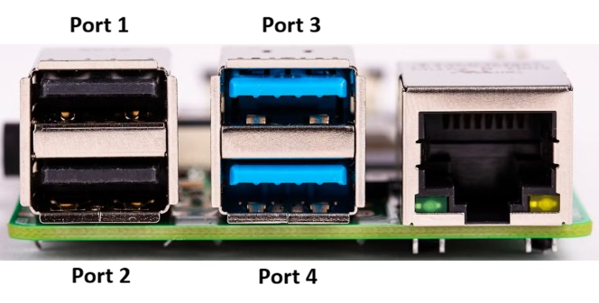

# Software Setup

This guide describes how to install and configure the software required
to run the **Remote Cell Culture Monitor** system on a **Raspberry Pi
5** using **Raspberry Pi OS 64-bit Lite (headless)**.

The system uses:

-   Raspberry Pi OS Lite
-   Apache2 web server
-   Motion for USB camera streaming
-   Optional secure remote access

------------------------------------------------------------------------

# Hardware Platform

Tested configuration:

  Component               Specification
  ----------------------- -------------------------------
  Single board computer   Raspberry Pi 5
  Operating system        Raspberry Pi OS Lite (64-bit)
  Cameras                 USB microscope cameras
  Storage                 microSD card (32GB or larger)
  Network                 Ethernet or WiFi

------------------------------------------------------------------------

# Install Raspberry Pi OS (Headless)

Download the latest version of **Raspberry Pi Imager** e.g. v2.0.6 from:

https://www.raspberrypi.com/software/

Insert your microSD card and select:

Raspberry Pi OS (Other) -> Raspberry Pi OS Lite (64-bit)

This version has **no desktop environment**, which reduces system
overhead and improves stability for server applications.

------------------------------------------------------------------------

# Configure Customisations

Before flashing the OS, apply OS customisation settings in Raspberry Pi Imager.

-   Set hostname e.g.: raspberrypi
-   Set username and password
-   Configure WiFi
-   Enable SSH (Use password authentication)
-   Dont Enable Raspberry Pi Connect

WRITE the SD card and when done, insert it into the Raspberry Pi.

For simplicity, first time booting a fresh installation, connect a PC monitor, keyboard and mouse to the Raspberry Pi.

Boot the Raspberry Pi.

Login to the Raspberry Pi.

In future you can remove the PC monitor, keyboard and mouse and instead connect via SSH.

Example from Windows terminal using the hostname you previously set:
```
ssh pi@raspberrypi.local
```
Type yes when prompted. 

Alternatively if you know the Raspberry Pi IP address for example if it was 192.168.1.50, then:
```
ssh pi@192.168.1.50
```
Type yes when prompted.

------------------------------------------------------------------------

# Update the System

Once connected via ssh using Windows Terminal, update the OS:
```
sudo apt update
sudo apt upgrade -y
```
------------------------------------------------------------------------

# Install Apache2 Web Server

Install Apache:
```
sudo apt install apache2 -y
```
Verify the service is running:
```
sudo systemctl status apache2
```
Among the text you should see something similar to:
```
Active: active (running)
```
------------------------------------------------------------------------

# Test the Web Server

If you set your hostname to 'raspberrypi' previously then open a browser on your local network and navigate to:
```
http://raspberrypi.local
```
Otherwise replace 'raspberrypi' above with the hostname you choose. 

Or if you know the IP address of your Raspberry Pi, example:
```
http://192.168.1.50
```
You should see the default Apache page:
```
Apache2 Debian Default Page
```
------------------------------------------------------------------------

# Web Root Directory

The default web root is:
```
/var/www/html
```
Example files:
```
/var/www/html/index.html
```
You can place your monitoring interface here.

------------------------------------------------------------------------

# Optional: Create a Web Project Directory

Example structure:
```
/var/www/html/camera
```
Create the directory:
```
sudo mkdir /var/www/html/camera
```
Set permissions:
```
sudo chown -R pi:www-data /var/www/html
```
------------------------------------------------------------------------

# Install Motion (USB Camera Streaming)

Install Motion:
```
sudo apt install motion -y
```
Verify installation:
```
motion -h
```
------------------------------------------------------------------------

# Motion Configuration Location

Motion configuration files are located in:
```
/etc/motion/
```
Default contents:
```
/etc/motion
├── motion.conf
├── camera1-dist.conf
├── camera2-dist.conf
├── camera3-dist.conf
└── camera4-dist.conf
```
New contents:
```
/etc/motion
├── motion.conf
├── thread1.conf
├── thread2.conf
├── thread3.conf
└── thread4.conf
```
Each **thread file** corresponds to one camera.
------------------------------------------------------------------------

# Install Motion Configuration

Clone the repository to the Raspberry Pi from the terminal:

```
cd ~
git clone https://github.com/richardmorgan1530/remote-cell-culture-monitor.git
```

Enter the repository directory:

```
cd remote-cell-culture-monitor
```

Copy the Motion configuration files:

```
sudo cp configs/motion/motion.conf /etc/motion/
sudo cp configs/motion/thread*.conf /etc/motion/
sudo rm /etc/motion/camera*-dist.conf
```
------------------------------------------------------------------------

# Attach USB Cameras

Connect the USB cameras to the Raspberry Pi 5 before starting Motion.

<p align="center">
  <br>
  <em>Figure: Raspberry Pi 5 USB ports showing positions used for CAM1–CAM4 mapping.</em>
</p>

Plug each camera into one of the Raspberry Pi USB ports.

Example setup:

CAM1 → USB port (top left)  
CAM2 → USB port (bottom left)  
CAM3 → USB port (top right)  
CAM4 → USB port (bottom right)

Using fixed USB ports helps maintain stable device paths when the
system is rebooted.

# Note: Using Fewer Than Four Cameras

If fewer than four USB cameras are connected, you must disable the unused
camera threads in the Motion configuration file.

Open the Motion configuration file:
```
sudo nano /etc/motion/motion.conf
```
Locate the thread definitions at the bottom of the file:
```
thread /etc/motion/thread1.conf
thread /etc/motion/thread2.conf
thread /etc/motion/thread3.conf
thread /etc/motion/thread4.conf
```
Comment out any unused cameras by adding `#` at the beginning of the line.
Example (2 cameras only):
```
thread /etc/motion/thread1.conf
thread /etc/motion/thread2.conf
#thread /etc/motion/thread3.conf
#thread /etc/motion/thread4.conf
```
After editing close and save the file:
```
ctrl + x
Y
press enter
```
Unused thread configurations may cause errors if the corresponding
camera device is not connected.
------------------------------------------------------------------------

# Detect USB Cameras

List connected cameras:
```
ls /dev/video\*
```
Example:
```
/dev/video0
/dev/video1
/dev/video2
```
You can also use:
```
v4l2-ctl --list-devices
```
Display a USB camera - image compression specs:
```
v4l2-ctl --device=/dev/video0 --list-formats-ext
```
------------------------------------------------------------------------

# Enable Motion Service

Enable Motion to start automatically:
```
sudo systemctl enable motion
```
Start Motion:
```
sudo systemctl start motion
```
Check service status:
```
sudo systemctl status motion
```
------------------------------------------------------------------------

# Test Camera Stream

Once Motion is running, open:
```
http://`<raspberry-pi-ip>`:8081
```
Example for Camera 1:
```
http://192.168.1.50:8081
or
http://raspberrypi.local:8081
```
Example for Camera 2:
```
http://192.168.1.50:8082
or
http://raspberrypi.local:8082
```
Example for Camera 3:
```
http://192.168.1.50:8083
or
http://raspberrypi.local:8083
```
Example for Camera 4:
```
http://192.168.1.50:8084
or
http://raspberrypi.local:8084
```
Each thread exposes a separate port.

------------------------------------------------------------------------

# Typical Camera Ports

| Camera   | Stream Port |
| -------- | ----------- |
| Camera 1 | 8081        |
| Camera 2 | 8082        |
| Camera 3 | 8083        |
| Camera 4 | 8084        |

------------------------------------------------------------------------

# Next Steps

After completing the software setup:

1.  Configure Motion camera threads
2.  Integrate streams into the web interface
3.  Configure remote access
4.  Configure snapshot and timelapse capture

See additional documentation:
```
docs/hardware-setup.md 
docs/network-access.md
```
